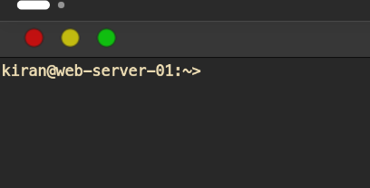
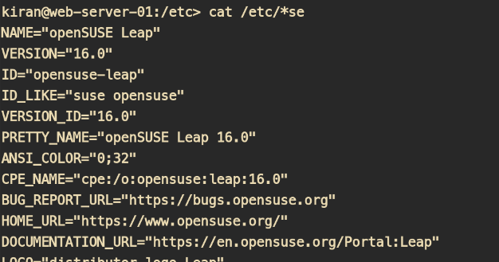

 ## The basics

 - Accessing the servers/VMs:

When you want to "login" to a server running Linux Operating system (henceforth referred as Linux Machine), you use a SSH client such as putty, or Windows Terminal or any other tool. The authentication is generally done with the help of SSH Keys. Someone with admin rights have to copy your public key into the server and then you can do the password-less login. More on it later.

- Navigating around the computer. You enter a command into the SSH-Client (henceforth called as terminal for simplicity) and the command is sent to the linux machine and output displayed on the terminal. For instance let's assume we are connected to the linux machine called as web-server-01. Now, let's run our first command
`whoami` and hit enter. The output will be the name of the user with which you logged into the machine. 

<!-- Insert Image of the command and output -->


### The Prompt:
When you open a terminal session on your local machine (running Linux or Windows Subsystem for Linux) or connected to a remote machine with SSH, the first thing you would see is a prompt



THe prompt generally gives you three pieces of info. On most systems the prompt is of the below format: 

```bash
<username>@<hostname>:<current_directory> >
```
In the above pic, the username is `kiran` and the hostname (name of the computer) is `web-server-01` and the current directory is `~`

> ~ is representation of the Home directory of the user which is generally /home/<username>

When a user changes the directory, the prompt also changes. For instance if the user changes into /etc, the prompt looks like this : `kiran@web-server-01:/etc>`.
Notice the part after the colon, it says `/etc`

### Which Operating System are you logged in to ?

Let's say you are given access to a system and you are able to login to the machine without any other info (Metadata) of the machine. How do you know which operating system you are logged in? yes, Linux, but what is the distribution you loggedd in.

The easiest way to know that is with the command 

```bash
cat /etc/*-release 
```



This command works because there is generally file called as `os-release` or just release under the directory /etc.


`hostnamectl` also gives the details of the distribution and Kernel version. 
`lsb_release -a` also gives you the distribution name.

Another important command to know how long your system has been running and what is the CPU usage is
`uptime`

uptime gives you the output in the below foemat:

```
current_system_time up <time-since-the-system-started> <no.of users connected> load average: <> <> <>
```

Example


In the eabove example, the current time of the system is `21:43:42`. System was last booted 13 minutes ago and 1 user is connected to the system.
and the Load average .  

Load average is the amount of load the CPU has taken in last 1 minute, 5 minutes and 15 minutes.

In the above example the part `load average: 1.45, 1.49, 1.07` tells us the load average in the last 1 minute is 1.45 and last 5 minutes is 1.49 and 15 minutes is 1.09.

What do we infer from these numbers? These numbers can only be understood if you know number of CPUs. 
The easiest way to know the number of CPUs is using the command `lscpu` which shows the total number of CPUs. If 

the output of `lscpu` looks as below, which gives us the no of CPUs as 12

```base
Architecture:                x86_64
  CPU op-mode(s):            32-bit, 64-bit
  Address sizes:             39 bits physical, 48 bits virtual
  Byte Order:                Little Endian
CPU(s):                      12
  On-line CPU(s) list:       0-11
Vendor ID:                   GenuineIntel
  Model name:                12th Gen Intel(R) Core(TM) i7-1255U
    CPU family:              6
    Model:                   154
    Thread(s) per core:      2
    Core(s) per socket:      10
    Socket(s):               1
    Stepping:                4
    CPU(s) scaling MHz:      26%
```

The load average is calculated based on the number of processes in two states:
    Running (R): Processes currently using the CPU.
    Uninterruptible sleep (D): Processes waiting for I/O operations to complete.
A load average of 1.0 on a machine with 1 Core means the CPU is at 100% utilization but the same load on a 2 Core system means that there is only 50% utilization of CPUs.
In our example 1.45 on a 12-core means a lot of CPU is free.

To check the system health top is another great utility.

How do we check the memory available and memory utilized. The easiest way is to use the command `free -h`


```bash
free -h
               total        used        free      shared  buff/cache   available
Mem:            38Gi       8.2Gi        26Gi       1.6Gi       6.2Gi        30Gi
Swap:           74Gi          0B        74Gi
```


## Navigation 

```bash
pwd
```


